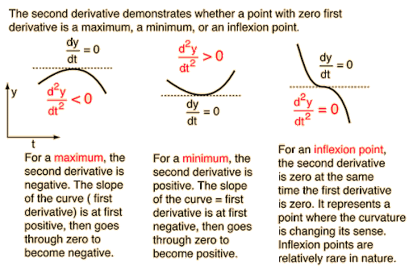

# This is Yushan's awesome website

what if i add some text here?


## Here's a subsection

here's some additional text

```{r}
rnorm(10)
```

# Links to other website

link to useful tools for data science

*[Google](https://www.google.com)

*[P8105](https://www.p8105.com)


# local image

Here's something for my probability homework



Or i can use this commend: 

# link to page within the site

[About me](about.html)


## here are some tabs {.tabset}

### By Product

(tab content)

### By Region

(tab content)


